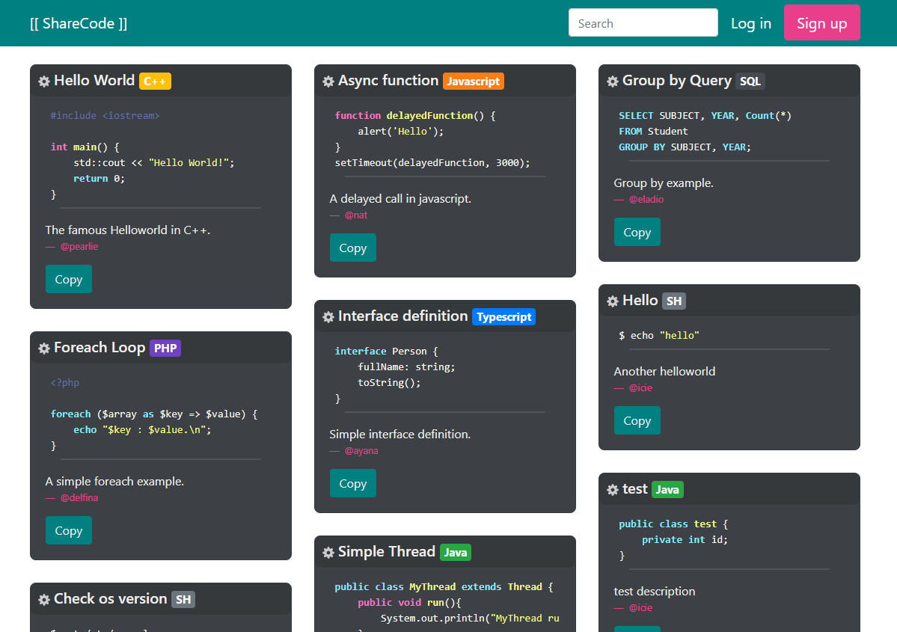
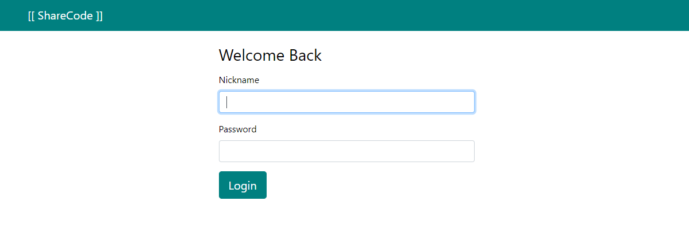
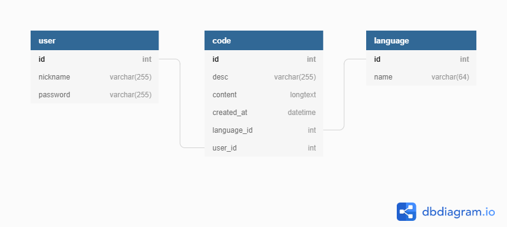

# [[ Share Code ]]

## Description

It's a simple **Symfony** web project where **USER**s can share **CODE** choosing their **LANGUAGE**.

It was made for my students to illustrate the **Symfony classroom**.

## Database

The structure is really simple:

