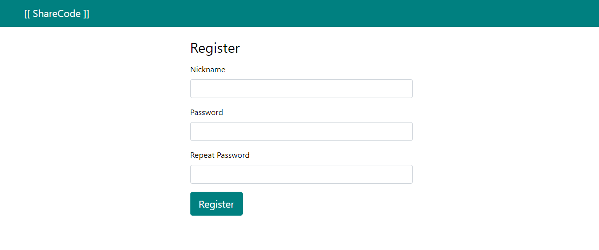
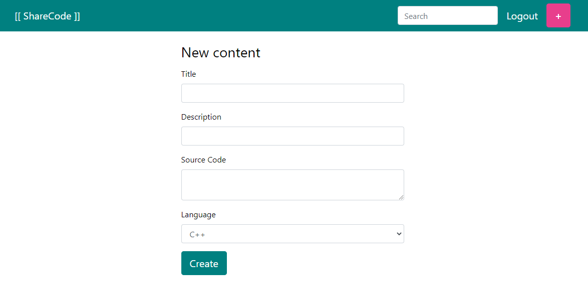

# [[ Share Code ]]

## Description

It's a simple **Symfony** web project where **USER**s can share **CODE** choosing their **LANGUAGE**.

It was made for my students to illustrate the Symfony & api-platform **classroom**.

- Live demo on Heroku: https://sharecodeapp.herokuapp.com/

- Live demo **api-plaform**: https://sharecodeapp.herokuapp.com/api

## Database

The structure is really simple:

